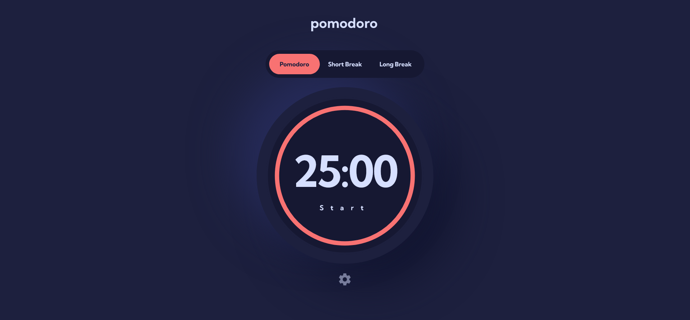

# Frontend Mentor - Pomodoro app solution

This is a solution to the [Pomodoro app challenge on Frontend Mentor](https://www.frontendmentor.io/challenges/pomodoro-app-KBFnycJ6G). Frontend Mentor challenges help you improve your coding skills by building realistic projects.

## Overview

### Screenshot

### Links

-   Solution URL: [Github](https://github.com/MarcinFiuk/Pomodoro)
-   Live Site URL: [Vercel](https://pomodoro-marcinfiuk.vercel.app/)

### Built with

-   Semantic HTML5 markup
-   CSS custom properties
-   Flexbox
-   Mobile-first workflow
-   [React](https://reactjs.org/) - JS library
-   [Styled Components](https://styled-components.com/) - For styles
-   [Focus-trap-react](https://github.com/focus-trap/focus-trap-react) - For accessibility (used in modal)
-   [Redux](https://redux.js.org/) - For store state (used for a learning purpose)

### What I learned

I learnt a few new concepts:

-   Focus should be trapt inside modal (for accessibility)
-   Basic redux

## Author

-   Frontend Mentor - [@MarcinFiuk](https://www.frontendmentor.io/profile/MarcinFiuk)
-   Twitter - [@marcin_fiuk](https://twitter.com/marcin_fiuk)

## Acknowledgments

Thank you to my mentor [Alex](https://www.linkedin.com/in/alexrohleder/) for feedback and guidance on this project.
